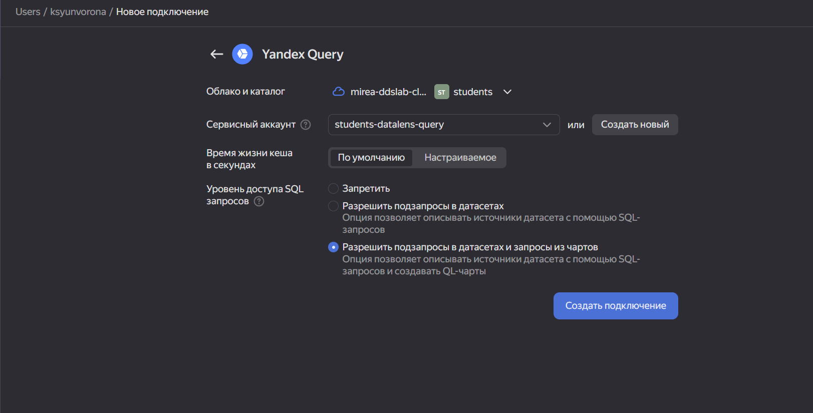
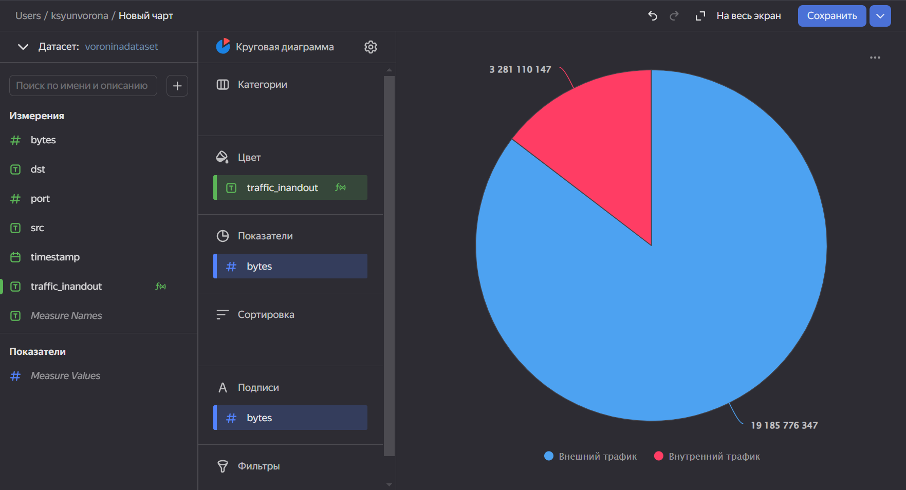
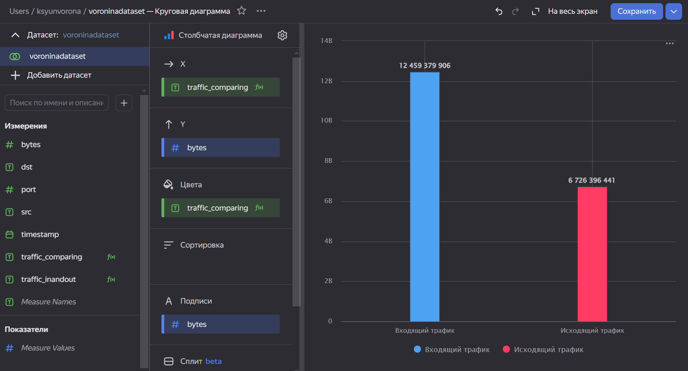
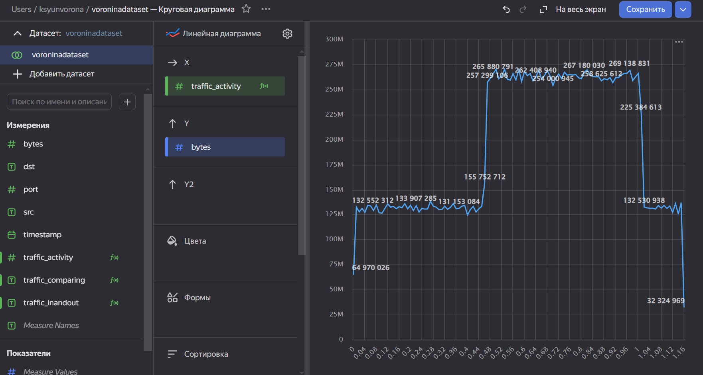
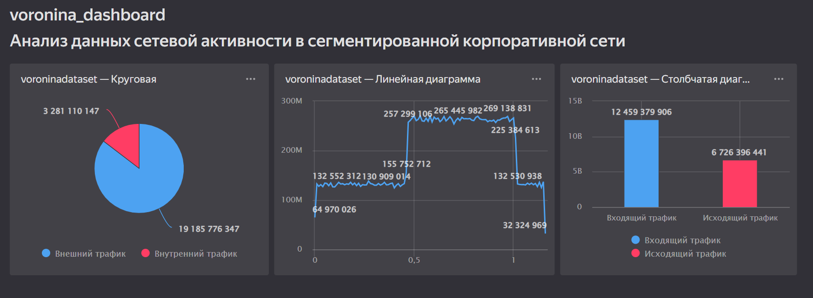

# Использование технологии Yandex DataLens для анализа данных сетевой активности

# Лабораторная работа №6. Использование технологии Yandex Query DataLens для анализа данных сетевой активности

## Цель работы

1.  Изучить возможности технологии Yandex Query для визуального анализа структурированных наборов данных
2.  Получить навыки визуализации данных для последующего анализа с помощью сервисов Yandex Cloud
3.  Получить навыки создания решений мониторинга/SIEM на базе облачных продуктов и открытых программных решений
4.  Закрепить практические навыки использования SQL для анализа данных сетевой активности в сегментированной корпоративной сети

## Исходные данные

1.  Программное обеспечение Windows 11 Pro
2.  Аккаунт, подключенный к Yandex Cloud Organization

## План

1.  Представить в виде круговой диаграммы соотношение внешнего и внутреннего сетевого трафика.
2.  Представить в виде столбчатой диаграммы соотношение входящего и исходящего трафика из внутреннего сетвого сегмента.
3.  Построить график активности (линейная диаграмма) объема трафика во времени.
4.  Все построенные графики вывести в виде единого дашборда в Yandex DataLens.

## Шаги

1.  Настраиваем подключение к YandexQuery из DataLens



2.  Создаем датасет с таблицей yaqry2dataset


3.  Создаем чарт и выполняем три первые задачи практической работы:

а) Представить в виде круговой диаграммы соотношение внешнего и внутреннего сетевого трафика



В поле traffic_inandout представлена следующая функция на языке SQL:

```         
IF (([dst] LIKE '12.%' OR [dst] LIKE '13.%' OR [dst] LIKE '14.%') AND ([src] LIKE '12.%' OR [src] LIKE '13.%' OR [src] LIKE '14.%')) THEN "Внутренний трафик" ELSE "Внешний трафик" END
```

В параметре ПОКАЗАТЕЛИ и ПОДПИСИ представлено количество байт передаваемого трафика.

б) Представить в виде столбчатой диаграммы соотношение входящего и исходящего трафика из внутреннего сетвого сегмента.



В парметрах Y и ПОДПИСИ выставлено количество байт передаваемоего трафика, а в параметрах X и ЦВЕТА представлена следующая функция на языке SQL:

```         
IF (([src] LIKE '12.%' OR [src] LIKE '13.%' OR [src] LIKE '14.%') AND (NOT([dst] LIKE '12.%' OR [dst] LIKE '13.%' OR [dst] LIKE '14.%'))) THEN "Исходящий трафик" ELSEIF (([dst] LIKE '12.%' OR [dst] LIKE '13.%' OR [dst] LIKE '14.%') AND (NOT([src] LIKE '12.%' OR [src] LIKE '13.%' OR [src] LIKE '14.%'))) THEN "Входящий трафик" END
```

в) Построить график активности (линейная диаграмма) объема трафика во времени.



В качеcтве параметра Y и ПОДПИСИ взято количество байт передаваемоего трафика, а в качеcтве пареметра X представлена следующая функция на языке SQL:

```         
ROUND(([timestamp] - DATETRUNC([timestamp], "second")) * 100000,2)
```

г) Все построенные графики вывести в виде единого дашборда в Yandex DataLens.



## Оценка результата

В ходе выполнения данной лабораторной работы были изучены возможности YandexQuery для анализа структурированных наборов данных. Также был проведен анализ сетевой активности, составлены чарты и дашборд на основе проделанной работы.

## Вывод

Yandex DataLens - сервис анализа и визуализации данных от Yandex Cloud. 
Yandex DataLens имеет интуитивно понятный интерфейс, позволяющий пользователям быстро начать работу с данными. Данный сервис предоставляет множество функций для анализа данных: визуализация, создание отчётов и прогнозирование.

```{r}

```

